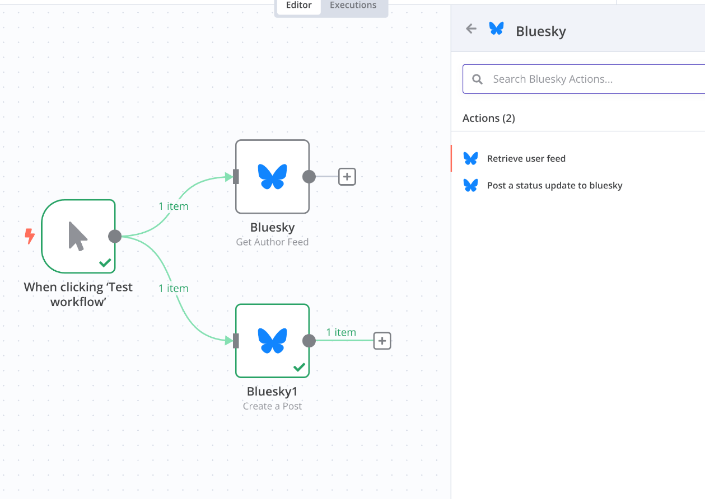
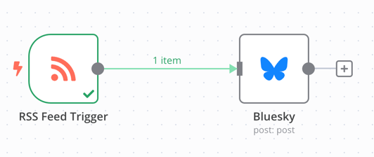
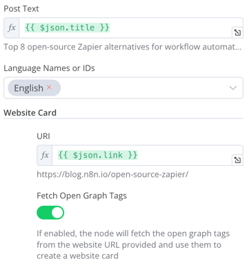

# n8n-nodes-bluesky-enhanced

This is a fork of [@muench-dev/n8n-nodes-bluesky](https://github.com/muench-dev/n8n-nodes-bluesky) with enhanced functionality for the Bluesky social network.

## Added Features

- **List All Followers Operation**: Added ability to automatically fetch all followers for a Bluesky user with pagination support
  - Fetches followers via app.bsky.graph.getFollowers
  - Automatically pages through all results using the cursor
  - Configurable maximum limit for number of followers to retrieve
  - Configurable page size for each API request
- **List All Follows Operation**: Added ability to automatically fetch all accounts a user is following with pagination support
  - Fetches follows via app.bsky.graph.getFollows
  - Automatically pages through all results using the cursor
  - Configurable maximum limit for number of follows to retrieve
  - Configurable page size for each API request

## Installation

```bash
npm install n8n-nodes-bluesky-enhanced
```

In n8n community edition, you can install the nodes in the settings page by searching for `n8n-nodes-bluesky-enhanced`.

## Features

All original features, plus:

- User
	- Block User
	- Get Profile
	- **List All Followers** (New)
	- **List All Follows** (New)
	- Mute User
	- Un-mute User
- Feed
	- Get Author Feed
	- Get Timeline of current user
- Post
	- Create Post
	- Like
	- Unlike
	- Repost
	- Delete Repost

## Follower Pagination Configuration

When using the "List All Followers" operation, you can configure:

- **Handle**: The Bluesky handle (e.g., username.bsky.social) of the account whose followers you want to fetch
- **Max Results**: Maximum number of followers to fetch (default: 1000)
- **Page Size**: Number of followers per API request (default: 100, max: 100)

## Follows Pagination Configuration

When using the "List All Follows" operation, you can configure:

- **Handle**: The Bluesky handle (e.g., username.bsky.social) of the account whose follows you want to fetch
- **Max Results**: Maximum number of follows to fetch (default: 1000)
- **Page Size**: Number of follows per API request (default: 100, max: 100)

## Screenshots



## Use Cases

### RSS Feed to Bluesky

You can use the RSS Trigger node to get the latest posts from an RSS feed and then use the Create Post node to post them to Bluesky.



Use Open Graph Tags to get the image and description of the post.



### Follower Analysis

With the new "List All Followers" operation, you can:
- Track follower growth over time
- Build a follower database
- Analyze follower demographics
- Send welcome messages to new followers

### Follow Analysis

With the new "List All Follows" operation, you can:
- Analyze your following patterns
- Identify and remove inactive follows
- Discover new potential followers by analyzing mutual follows

### Network Analysis

With the "List All Follows" operation, you can:
- Compare followers vs. follows ratios
- Find mutual follows (people who follow each other)
- Discover influential accounts in your network
- Build connection maps between accounts

## License

MIT

## Acknowledgments

This project is based on [@muench-dev/n8n-nodes-bluesky](https://github.com/muench-dev/n8n-nodes-bluesky) by Christian Münch.
